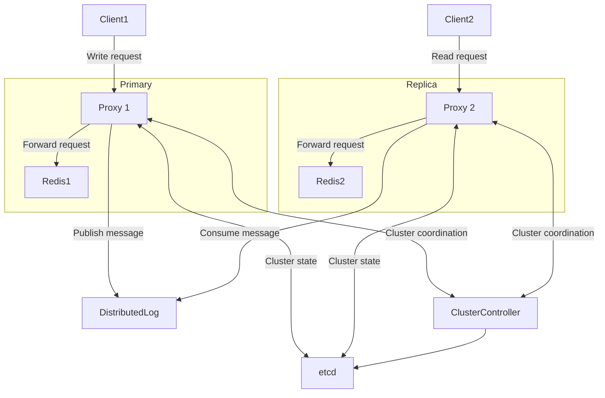

# Architecture

```mermaid
flowchart
subgraph Primary
    Proxy1[Proxy 1]--Forward request-->Redis1
    end

subgraph Replica
    Proxy2[Proxy 2]--Forward request-->Redis2
    end


Client1--Write request--> Proxy1
Client2--Read request--> Proxy2
Proxy1--Publish message---->DistributedLog
Proxy2--Consume message---->DistributedLog
Proxy1<--Cluster state---->etcd
Proxy2<--Cluster state---->etcd
Proxy1<--Cluster coordination---->ClusterController
Proxy2<--Cluster coordination---->ClusterController
ClusterController-->etcd
```

Distributed log can be any of below:

- Kafka-compatible system (RedPanda, Bufstream or Warpstream)
- Kinesis

