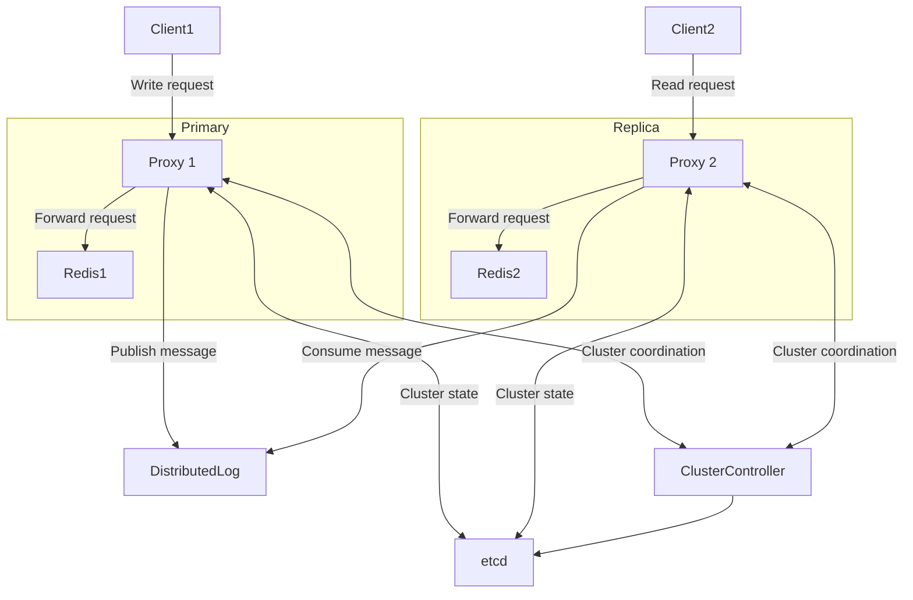

# Architecture



Distributed log can be any of below:

- Kafka-compatible system (RedPanda, Bufstream or Warpstream)
- Kinesis

## Benchmark result

```sh
# With proxy
~> redis-benchmark -t set -p 7781 -n 100000 --csv -c 1
"test","rps","avg_latency_ms","min_latency_ms","p50_latency_ms","p95_latency_ms","p99_latency_ms","max_latency_ms"
"SET","6058.04","0.159","0.088","0.143","0.239","0.351","17.743"

# Without proxy
~> redis-benchmark -t set -p 6379 -n 100000 --csv -c 1
"test","rps","avg_latency_ms","min_latency_ms","p50_latency_ms","p95_latency_ms","p99_latency_ms","max_latency_ms"
"SET","9630.20","0.099","0.048","0.103","0.127","0.167","2.535"
```

37% in rps loss, 50% higher avg latency

\* This proxy does not able to handle multiple clients (over 50) correctly
